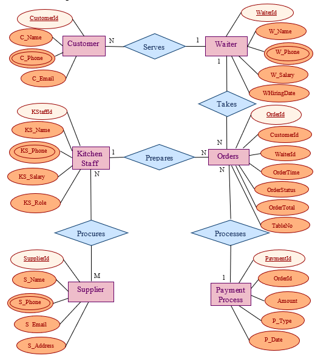

# DBMS-for-a-Restaurant-Management-System
This is part of a group project for a Database Management Sessional course. It is a SQL-based DBMS project for managing restaurant operations like orders, billing, customers, and staff.

## Overview
This project introduces a modern Database Management System(DBMS) tailored for restaurants. It replaces outdated manual methods and disconnected tools with a unified, digital solution. The system simplifies complex processes like order handling, inventory tracking, and payment processing— creating a seamless and efficient work flow that enhances both staff coordination and customer service.

## Technologies Used
- SQL
- MySQL 

---

## Database Schema Overview

The project includes the following key entities:

- **Customer**
- **Waiter**
- **Orders**
- **KitchenStaff**
- **Supplier**
- **Payment_Processor**

Refer to [`restaurant_schema.sql`](./restaurant_schema.sql) for full table creation queries.

---

## ER Diagram

An Entity-Relationship diagram illustrating relationships between tables is included:

---

## How to Use

1. Run `restaurant_schema.sql` to create all tables.
2. Run `insert_data.sql` to insert sample data.
3. Run `queries.sql` to test the functionality using SELECT and JOIN queries.

---

## Example Queries

Some examples from `queries.sql`:

- View all customers
- Join orders with customer and waiter details
- Calculate daily sales
- Group orders by waiter

---

## Project Status

- ✅ Tables created
- ✅ Data inserted
- ✅ Queries tested
- ✅ ER diagram added
- ✅ Documentation ready

---

## License

This project is licensed for educational use. See [`LICENSE`](./LICENSE) for details.

